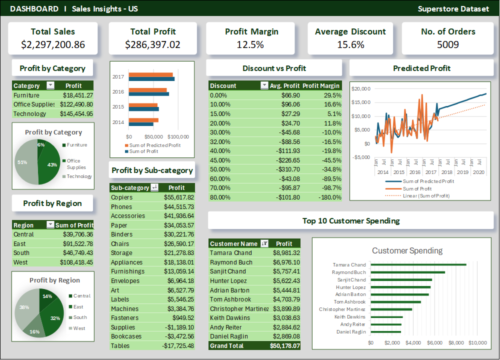

# Project 01 - An analysis of the 'Superstore Dataset'* in Excel

---
## Project Goal: “Identify what drives profit and how we can optimise sales performance.”

In this project I highlight my abilities to use Excel proficiently when processing and displaying data.
I use the platform to extract and display the most important and relevant data. *_Dataset Available [Here](https://www.kaggle.com/datasets/vivek468/superstore-dataset-final)_

---

## Table of Contents
- [Deliverables](#deliverables)
- [Areas of Interest](#areas-of-interest)
- [Data Analysis Workflow](#data-analysis-workflow)
- [Results](#results)
  - [Dashboard Preview](#dashboard-preview)
  - [Executive Summary](#executive-summary)
  - [Bullet Point Summary](#bullet-point-summary)
  - [Full Insight Summary](#full-insight-summary)

---

### Deliverables
1. A cleaned and validated dataset
2. A KPI summary including: 
  •	Total Sales
  •	Total Profit
  •	Profit Margin %
  •	Average Discount
3. A dashboard showing:
  •	Relationship of variables with profit
  •	Customer profitability
  •	Profit forecast for next 36 months
4. An insight summary

---

### Areas of Interest
Profitability:
- Which categories drive the most profit?
- Which sub-categories are underperforming?
- Which products are loss-making?
- How does discount affect profit?

Customer analytics:
- Who are the most valuable customers?
- What are the behaviours of high-value vs low-value customers?
- Which segments are the most profitable?

Regional performance:
- Which regions/states/cities have the highest profit margins?

Operations:
- Does shipping delay correlate with bad orders or low profit?

---

### Data Analysis Workflow
#### Data Inspection
- Identify column types and classify them (ID, Text, Categorical, Numeric, DateTime)
- Inpsect whole dataset
#### Data Cleaning
- Convert columns to correct number format
- Perform data checks (Discount sense check, Order date ≤ Ship date, No blanks)
#### Data Manipulation
- KPI calculations
- Pivot Tables - further insights
#### Dashboard Design
- Design layout - centre around KPIs
- Sections for each of the most important areas
- Add interactive elements
- Format and clean up

---

### Results

#### Dashboard Preview

All files associatd with the project are available for viewing or download [here](https://github.com/hht-99/data_and_software-portfolio/tree/main/project-01-excel_analysis)

#### Executive Summary

Overall, the business is profitable, but profit is highly sensitive to discounting and varies significantly across product categories and customer segments. Sales show gradual long-term growth, 
with profit growth very similar. A regression model indicates that sales volume is the main driver of profit, while order quantity and discount both impact negatively – the latter significantly. 
Despite this, forecasts show profit will continue to grow at a steady rate with no intervention. However, it is recommended to re-evaluate current discounts, or pricing, as nearly 20% of current
products produce a loss. 

---

#### Bullet Point Summary

##### Profitability:
- Annual profit margin averages at 12.4%.
- “Technology” category is the most profitable.
- Sub-category “Tables” produced the greatest loss
- Discounts above 20% correlate with increasingly negative profit margins.
- Region “West” performs best, while “Central” underperforms.
- Top 10 customers contribute nearly 18% of all profit.
- 300 of the 1845 products sold make a loss or breakeven.
- Subcategory “Binders” has the lowest margin at -20%.
- Recommendations:
  - Consider price changes, discount reduction or removal of lowest performing sub-categories (Tables and Binders).
  - Reducing deep discounting across all products would generate greater profit growth

##### Customer analytics:
- Most valuable customers:
  - Tamara Chand
  - Raymond Buch
  - Sanjit Chand
  - Hunter Lopez
  - Adrian Barton
  - Tom Ashbrook
  - Christopher Martinez
  - Keith Dawkins
  - Andy Reiter
  - Daniel Raglin
- Consumer segment is the most profitable, but Home Office has the greatest margin.
- Most orders came from the Consumer segment, least is from Home Office.
- High value customers make 2 more orders on average than low value.
- Top 10 customers make a profit of $50,000 (18% of profit), in contrast to the bottom 10 who produce a loss of $30,000.

##### Regional performance:
- The region ordering the most is “West”, while the “South” orders the least.
- The state producing the highest profit margin is the District of Columbia
- The cities with the largest profit margins are Atlantic City and Grand Island

##### Operations:
- A shipping delay has little effect on profit; no strong correlation was observed.

---

#### Full Insight Summary

[Download Full Insight Summary](../assets/FullInsightSummary.pdf)
